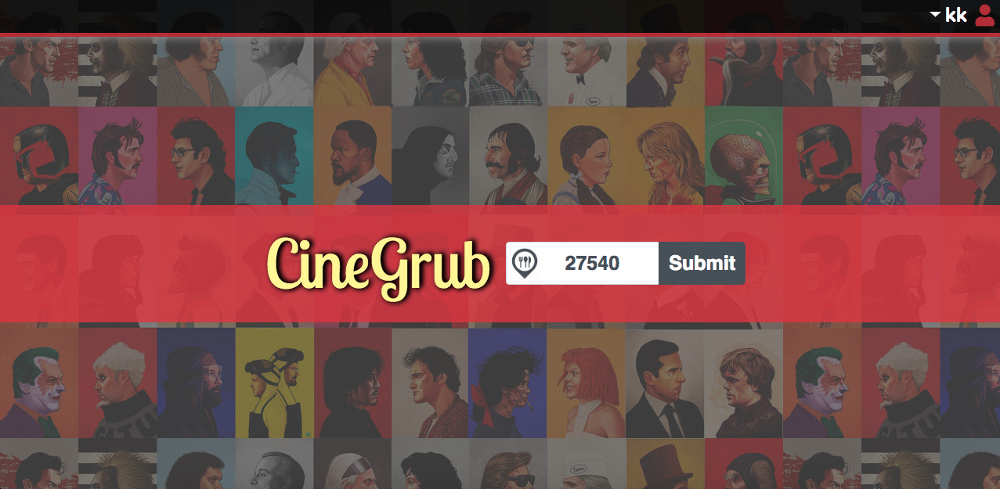
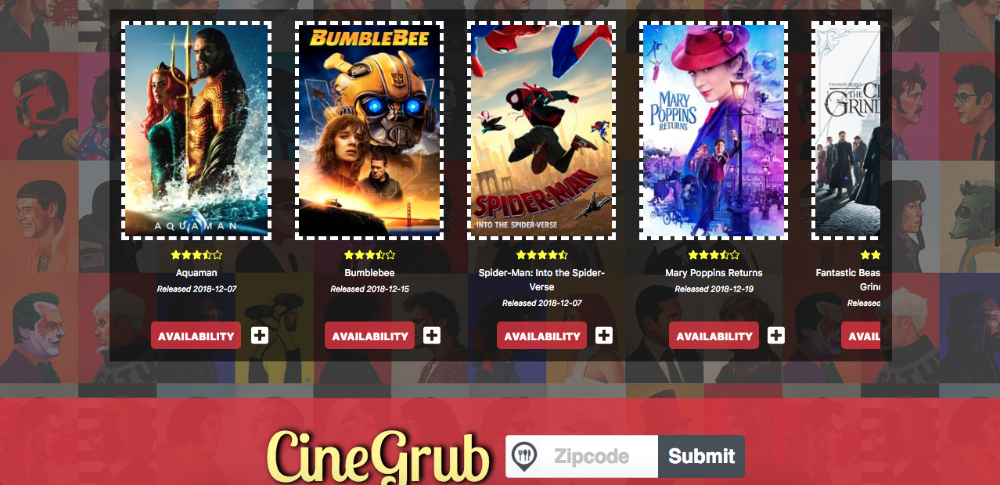
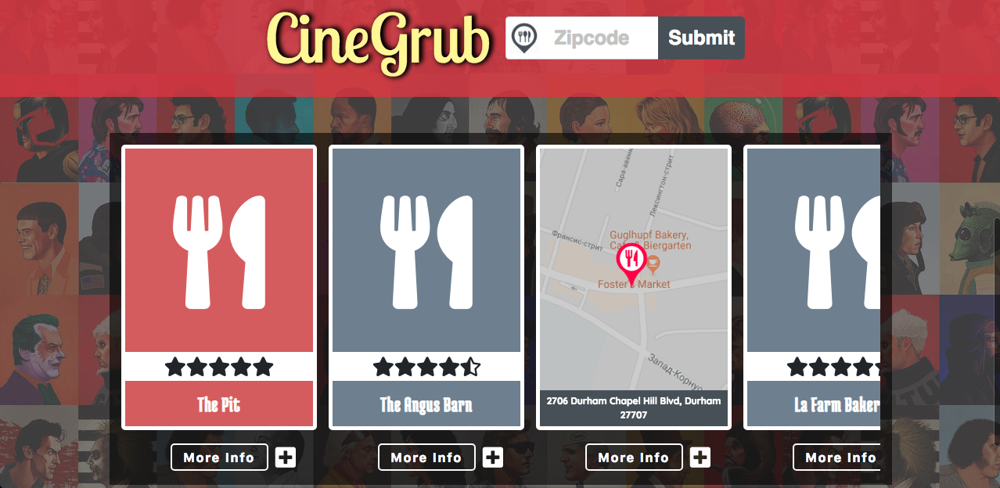
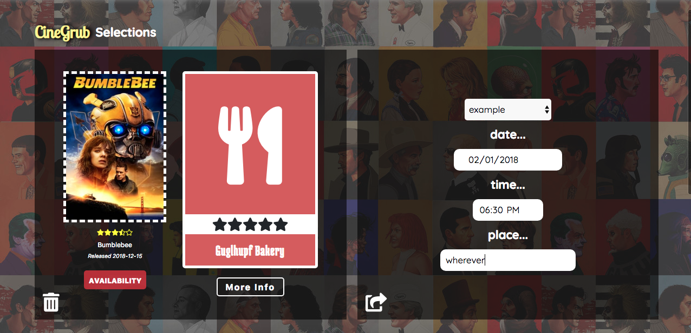

# project-1

CineGrub - Where Movies and Restaurants Come Together [cinegrub.com]

We created CineGrub as a site that would allow people to search for both a movie and a restaurant nearby to make planning nights out (or even afternoons) easier. CineGrub enables you to simultaneously search for food and entertainment and provides you with all the information you need to choose your favorites.

We wanted to create CineGrub as a more seamless solution to making plans with friends or figuring out date night. Several helpful sites already exist for movies and restaurants (like Yelp and Fandango), but we wanted to comebine those and create a more accessible and simpler user experience.

How to use the app:
 - At first you have to create an account with username and password. 
 - Than you will be able to enter your zipcode in the middle of the page and search for movies and restaurants neaby you.
 - For each movie and restaurant you can find small "+" button. By clicking on it you can add this movie or restaurant to your favourites.
 - In the top right menu you can choose "Current Plans" and see you chosen card. Also here you can choose friend from the list of users and invite him for the specific date and time and send him an invitation
 - In addition in the top right menu you can search for FAQ and contact information

We discussed the main objectives of our project and decided who would focus on specific goals.

Hannah - I contributed the code for the Zomato API and provided edits and changes to website copy for grammar and spelling. I created and updated the presentation deck. I structured and wrote the ReadMe file. 

Keiran - I worked on the FAQ page and contact form on the website. I attempted to include the JavaScript Google Maps API, but we ended up not using that specific API. I also contributed to the CSS. 

Kseniia - I worked on the AJAX request for the MovieDB APIs and the user authentication feature that saves data and allow users invite each other through their personal acoounts. I also worked on the invitation and favorites functionalities.

David - I worked on the overall CSS for the website. I created the functionality for the submit button, the loading icon, Google Maps API with AJAX, fixing user authentication bugs, and enhancing the Zomato & MovieDB APIs with star ratings using Font Awesome 5.

As a team, we additionally contributed on an as-needed basis. We collaborated and shared ideas, and worked together to make our project not only functional, but also fun and easy to use. 

Challenges we experienced were 
- including JavaScript API
- enabling zip code validation 
- setting up the Zomato API q parameter 

In the future, some features and additions we would add include 
- creating social media accounts and cultivate strong digital presence 
- enabling email invitations and notifications
- writing code that allows the enter key to submit zip code 
- converting from manual authentication to Firebase authorization for greater data protection through encryption
- adding mobile responsiveness to the website

